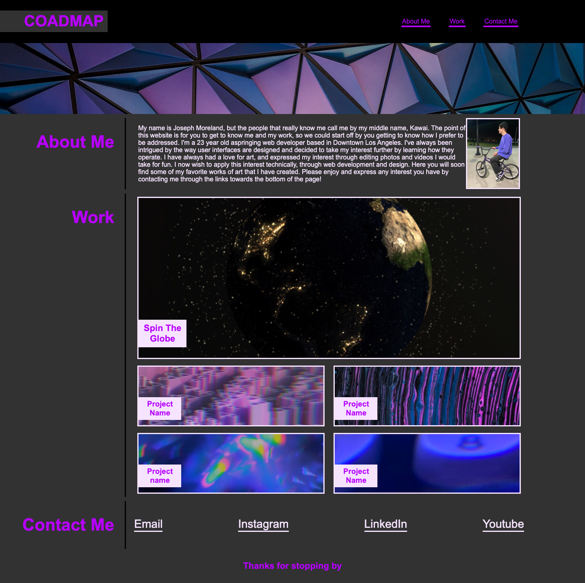

# coadmap

## Issues to be resolved
* As an up and coming full stack web developer I would like to create a portfolio for employers to access and see the works I have created
* I need to create a responsive page that shows my skills that I have learned during my time in the coding bootcamp
* I want the website to be visually appealing and responsive

## How the issues were tackled
* I created chronologically correct html and css files
* I added flex boxes to the content to give them a desired layout that is visually appealing
* Added hover effect to content to give a little flare to the content 
* Will add media queries to make the website responsive to different types of display screens

## Images
Screenshot of the full webpage

## Link to website and repo
* [Click here!](https://mosjoreland.github.io/coadmap/) to take a look at the website.
* [Click here!](https://github.com/mosjoreland/coadmap) to take a look at the github repo.